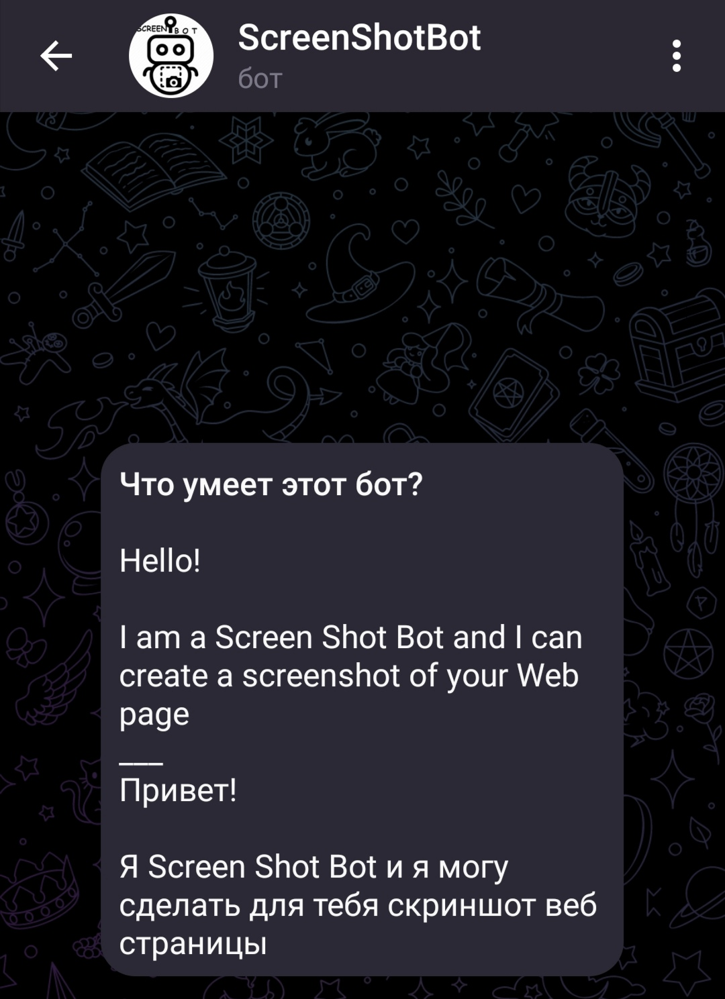
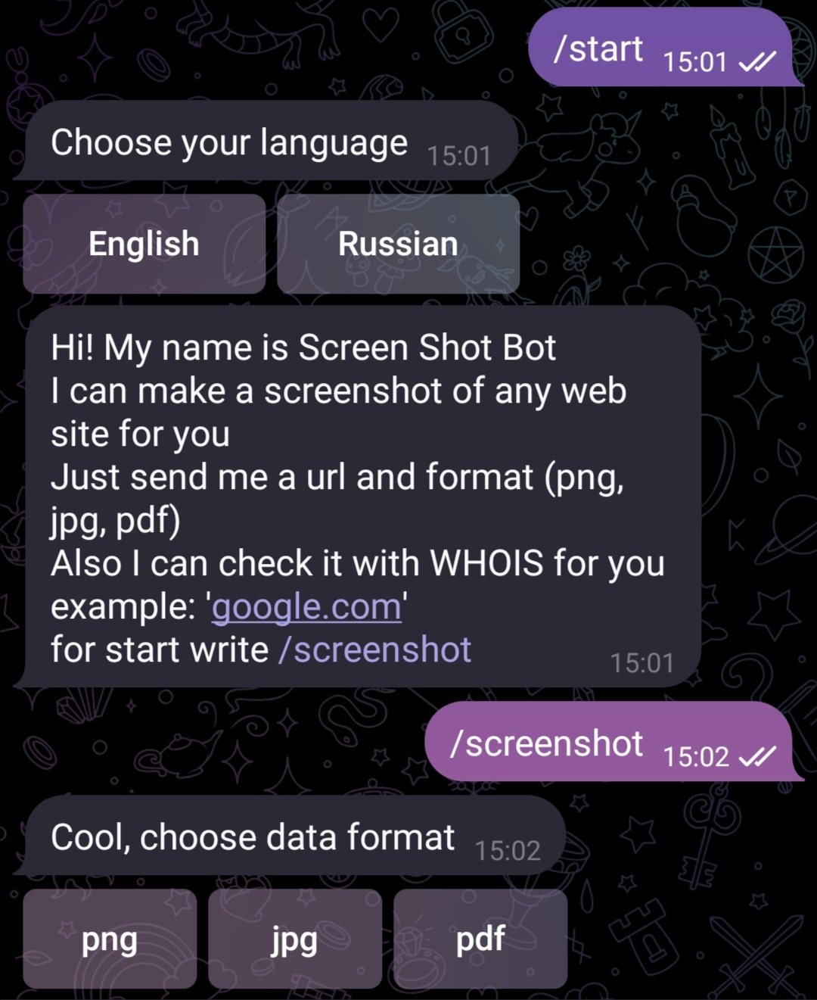
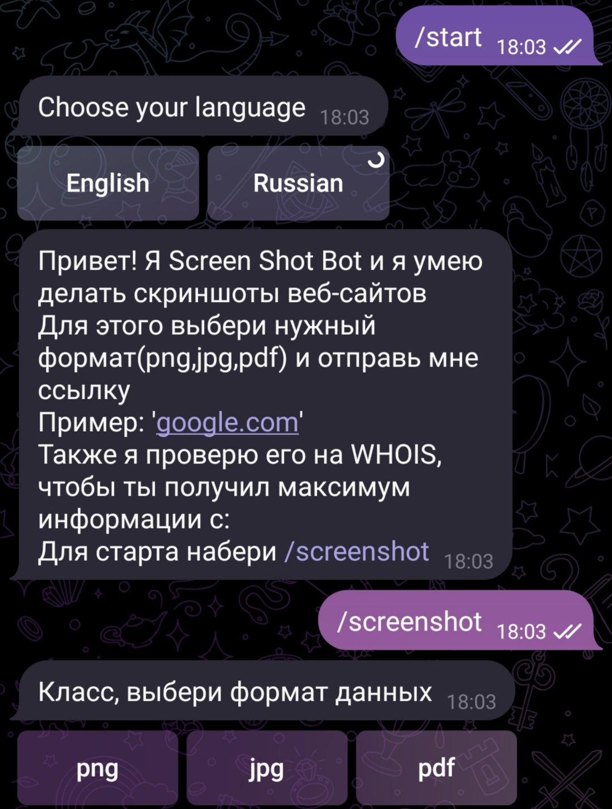

# Telegram bot - Screen Shot

## Description

---
This is a simple Telegram Bot based on python which make screenshot of web site. 
User can choose language (RU or ENG) for the interface and data format (png,jpg,pdf) with url for the screenshot. Also it have WHOIS checker for the website.
User get information about domain like creation and expiration date, emails, orgs and country. It could be helpful for user against of hackers/adversaries.  




## Architecture

---
Project created in Telegram_bot folder with this architecture:

```
Telegram_bot:
|
|/bot_images - icons and example of running
|
|/languages - files of eng and rus lang phrases
|
|/screens - folder for users screenshots
|
main.py - main file with all modules
language_handler - handler for /languages folder
search_whois - WHOIS module for check web site
screenshot - make screenshot of url and create file
log.conf - configuration log file
app.log - logging output file  
```
## Deployment

---
All packages in requirements.txt

`pip install pyTelegramBotAPI`

or build and run Docker container to automatically installing

Deployment:
1. Install Telegram messenger and create your account
2. Find @BotFather to sign new bot and get TOKEN
3. Also you can get him image and information about bot
4. Open project
5. *without Docker - install all dependencies and run main.py
5. *with Docker - install Docker to your computer, build image and run it 

example: 

```
docker build --pull --rm -f "docker\Dockerfile" -t dockerimage "docker" 
docker run -it --rm dockerimage
```

Also TOKEN are should be saved in .env
